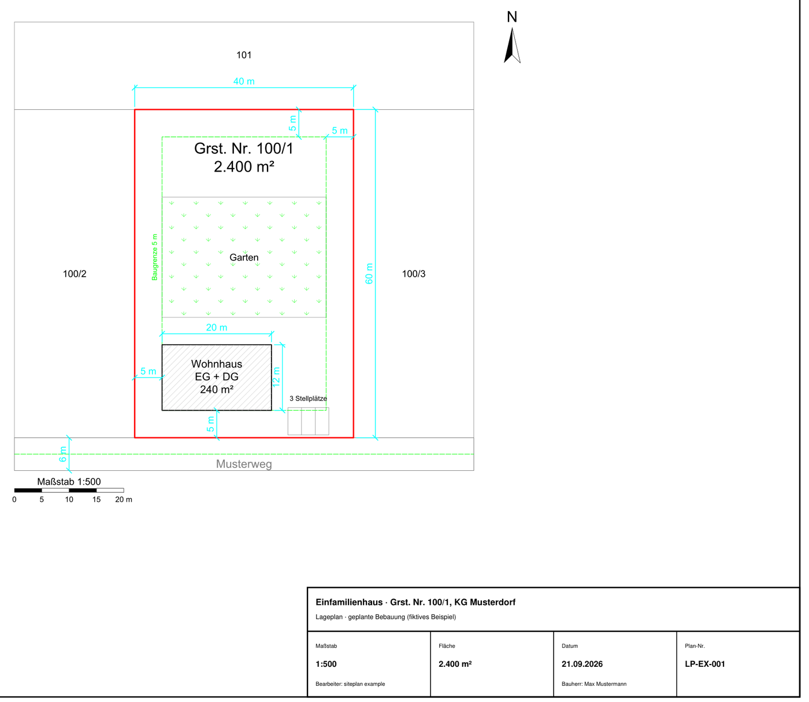

Picture a common situation in rural Austria. A plot has been zoned for building, but it sits
behind other plots. There is no frontage, only a strip of servitude along a neighbour's
boundary and a district road (*Landes-* or *Bezirksstraße*) a hundred metres away. Before
anything gets built, that plot needs a **connection** (*Anschluss*) to the road, and the road
authority has to agree to it.

What decides that conversation is not an argument. It is a drawing. A scaled plan that shows
where the access road runs, how wide it is, whose land it crosses and by how many square metres,
and where it meets the district road. The authority's engineer puts a ruler on it. If the
numbers don't hold up, you start over.

Drawing that plan used to mean a surveyor or a CAD technician and a few weeks per revision.
With an agent that can drive a CAD engine, a revision takes minutes, and you can afford to draw
five variants instead of one.

## The stack: a library, not a CAD program

The first question was which CAD tool an agent should drive. The candidates, briefly:

- **QCAD**: its command-line tools are commercial-only, and the free edition drops DWG.
- **LibreCAD**: no usable scripting.
- **FreeCAD**: a 3D parametric kernel, far too heavy for 2D site plans.
- **OpenSCAD**: no layers, no dimensions, no concept of plot scale.
- **ezdxf** (Python, open source): writes DXF directly, renders to PDF, fully headless.

The winner was the library. An agent doesn't need a GUI; it needs something it can call, and a
file format every CAD program opens. The plan is described as JSON in metres (parcels, roads,
buildings, labels, dimensions), and the engine writes a DXF plus a print-ready PDF with frame,
title block, north arrow and scale bar.

## A plan is only a plan if the scale is real

A picture that *looks* like 1:500 is worthless to an engineer with a ruler. So the engine does
not assume the scale, it **measures** it after every build: an 80 m edge must print at 160 mm
at 1:500. It prints at 159.93 mm, and the 0.05 % left over is the rounding of the PDF page
size to whole points, not the drawing. A check script prints PASS or FAIL, and nothing gets
handed over on FAIL.

## Real boundaries from the cadastre

Nobody wants to type in parcel corners. In Austria the federal survey office (BEV) publishes the
cadastre as open data, and the engine pulls it directly: give it a *Katastralgemeinde* and a
plot number, and it returns the real boundary, the neighbouring parcels with their numbers,
building footprints and existing roads.

Two traps are worth knowing about:

- The vector tiles carry true survey geometry **only at one zoom level** (16). One level up is
  generalised to about 1.6 m; one level down doesn't exist.
- Tiles are cut at fixed edges. A long parcel fetched with too small a window is **silently
  truncated**, and the truncated parcel still cross-checks perfectly against a second layer,
  because both are cut at the same line. Consistency is not completeness. Always fetch the
  parcel's full bounding box.

## Every real error was invisible from inside the generator

This is the lesson that cost the most. The code that draws a plan believes its own numbers. A
setback written as "2 m" in the generator measured 1.15 m on paper, because the neighbouring
boundary was skewed. A road corner rounded with a 12 m radius clipped 0.12 m² off a parcel it
was never supposed to touch: the arc bulges out beyond its straight chord.

So there is a second, independent script whose only job is to open the **finished** DXF and
measure it like an inspector would: areas per parcel, distances between buildings and
boundaries, whether the road stays inside the land it is allowed to use. The generator proposes;
the checker decides.

## What the road authority actually asks

A connection to a district road comes down to a few questions, and each one maps to something
the agent computes:

- **How wide is the road, and is that enough?** No single statute fixes a number. Guidelines
  give ranges. The strongest argument turned out to be local: measure the streets the
  municipality already built. Street parcels are long thin polygons, and their width can be
  measured exactly along the medial axis (twice the distance from the centre line to the
  boundary). In one municipality that gave a clean pattern: 7 m on entrance roads, exactly 6 m
  on inner branches, no side strips. "Your own standard" is hard to argue with.
- **Whose land, and how much?** Every variant produces a table: square metres of road on each
  owner's parcel, computed by polygon intersection, not estimated. That table is the basis of
  every negotiation that follows.
- **Where does it meet the road?** The junction position depends on sight distance, which grows
  with the permitted speed on the district road. The plan has to show the sight triangles and
  that nothing blocks them.
- **Can a truck turn?** Dead ends need a turning area sized for refuse and emergency vehicles.

## Variants are functions, not copies

The most useful structural decision: every variant is a function of one generator, with the
differences as parameters (which parcels the road may use, where it swings across, how the
land is split). Change one shared assumption and all variants rebuild consistently. The A4
print sets for the municipality are derived from the same objects, so the numbers on the
handout always match the big plan.

That is what made five variants affordable, and five variants is what makes a negotiation
possible. You can show a neighbour exactly what each option costs them in square metres, and
let them choose.

## What this says about agents

The agent is not doing anything a CAD technician can't. What changes is the economics: a
revision costs minutes, so you stop defending your first drawing and start comparing options.
Two rules make it trustworthy:

1. **Measure the output, never trust the generator.** Scale, areas and distances are re-checked
   on the finished file.
2. **Start from official data.** Cadastre boundaries, not a traced screenshot.

The engine is open source: [github.com/F3S0J/siteplan](https://github.com/F3S0J/siteplan),
with a fictional example plot and the instructions an agent needs to drive it.

*None of this replaces a licensed surveyor where the law requires one. It gets you to the
meeting with a drawing that survives a ruler.*
