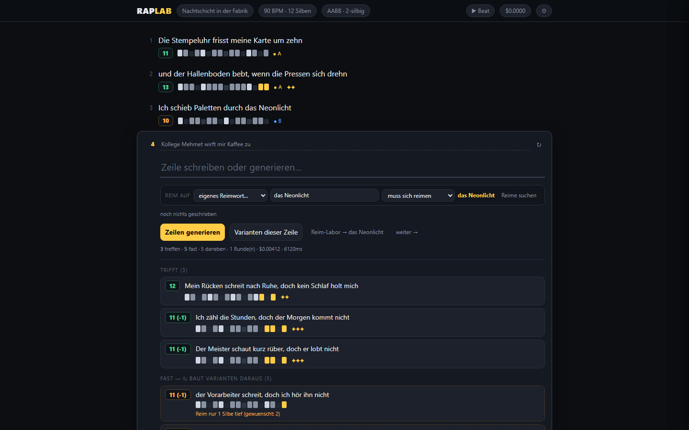

Ask a language model for a German rap verse with twelve syllables per line and an AABB rhyme
scheme, and you get something that sounds right and counts wrong. Lines drift to fourteen
syllables. "Rhymes" turn out to share a letter, not a sound. And when you ask the model to
check its own work, it cheerfully confirms that everything fits.

The model is not bad at writing. It is bad at *measuring*. So RapLab splits the job.

## Over-produce, then judge

For every line, the model writes far too many candidates: 16 to 24 per round, up to three
rounds. None of them is trusted. A small deterministic module, `syllables.py`, measures
every candidate, and only then do I see them, sorted into **hits**, **almost** and **off**.

- The number badge is the measured syllable count, with the difference to the target.
- The blocks under each line are its syllables, and the highlighted ones are the rhyming tail.
- The stars are rhyme depth: how many syllables from the end still rhyme.

I pick. The model never gets the final word, and it never gets to grade itself. That split
is why it works, not the prompt.

## How the judge hears German

The judge is about two hundred lines of rules, no dictionary, no model:

- **Syllables are vowel groups.** Diphthongs (*ei, au, eu, äu, ie*) are taken first, so
  *Stunden* counts two and *Neonlicht* three. Words ending in *-ie* are one syllable
  (*Melodie*), except a hard-coded list of Latin loanwords that split (*Fa-mi-li-e*). There
  is no rule that tells those apart, so it has to be a list.
- **A rhyme is a vowel sequence.** The rhyme key is the vowels of the last *n* syllables, and
  the consonants between them don't matter. That makes *Tonnen schwer*, *kommen her* and
  *hoffe mehr* one family, which is how rap actually rhymes. Vowels that sound alike are
  merged first: *ä* = *e*, *ai/ay/ey* = *ei*, *ie* = *i*.
- **A pure rhyme is a bonus, not a requirement.** The final consonants are compared after
  sound rules (silent *h* dropped, *sch/ch/ck/ph/tz* collapsed, final *d/b/g* read as
  *t/p/k*, so *Rad* rhymes with *Rat*). Assonance alone already counts as a hit.
- **Depth is measured.** The judge walks back one, two, three syllables until the vowels stop
  matching. *doch der Morgen kommt nicht* against *das Neonlicht* reaches three deep.
- **Repetition is word overlap.** A candidate that shares three content words with a finished
  bar is a repeat, whatever the word order. Ending on the anchor word itself is always
  rejected.

## Four prompt traps

These each cost an evening. They generalise well beyond lyrics.

1. **Don't hand the model a list of mandatory endings.** Given a list of rhyme words, it
   glued fragments onto the end of lines to satisfy it: grammatical nonsense with a perfect
   rhyme. The list is now inspiration only, and the judge decides phonetically.
2. **Forbid the obvious, explicitly and repeatedly.** With the anchor *der Sonne*, 37 of 48
   candidates simply ended on *Sonne* again: an identical rhyme, worthless. With an explicit
   ban it dropped to zero, and one round produced ten hits instead of two in three rounds.
3. **Force a new rhyme family per block.** Otherwise the model keeps continuing the sound of
   the previous lines, and a whole track ends on the same syllable.
4. **Tame output is often your own fault.** Bars that were too polite came from my own system
   prompt, not from a policy. There is now an explicit intensity setting.

## Cost

With a fast model a bar costs about a third of a cent to draft; with a stronger one about a
cent, and noticeably better German. Sixteen bars come to ten or twenty cents. The judge is
free and provider-agnostic: any OpenAI-compatible endpoint (a local model via Ollama, or a
router) can be plugged in as a second generator.

## The general pattern

Whenever a task has a part that can be **measured**, take that part away from the model:
syllables, dates, sums, lengths, whether a citation exists. Let the model do what it is good
at, which is producing many plausible options, and let a boring, deterministic piece of code
throw most of them away.

The code is open source: [github.com/F3S0J/raplab](https://github.com/F3S0J/raplab).
