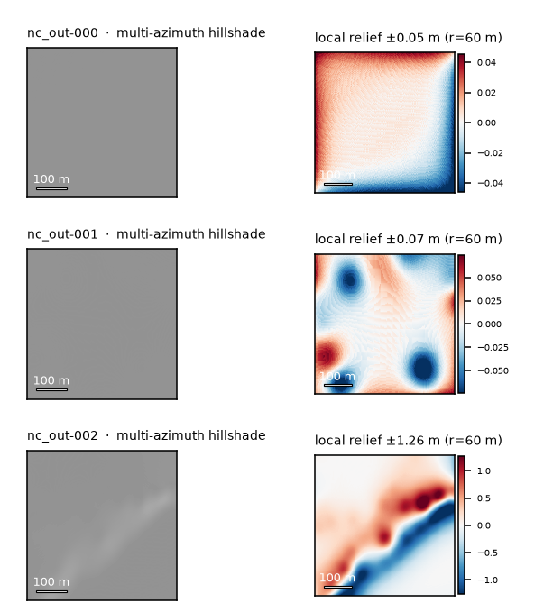
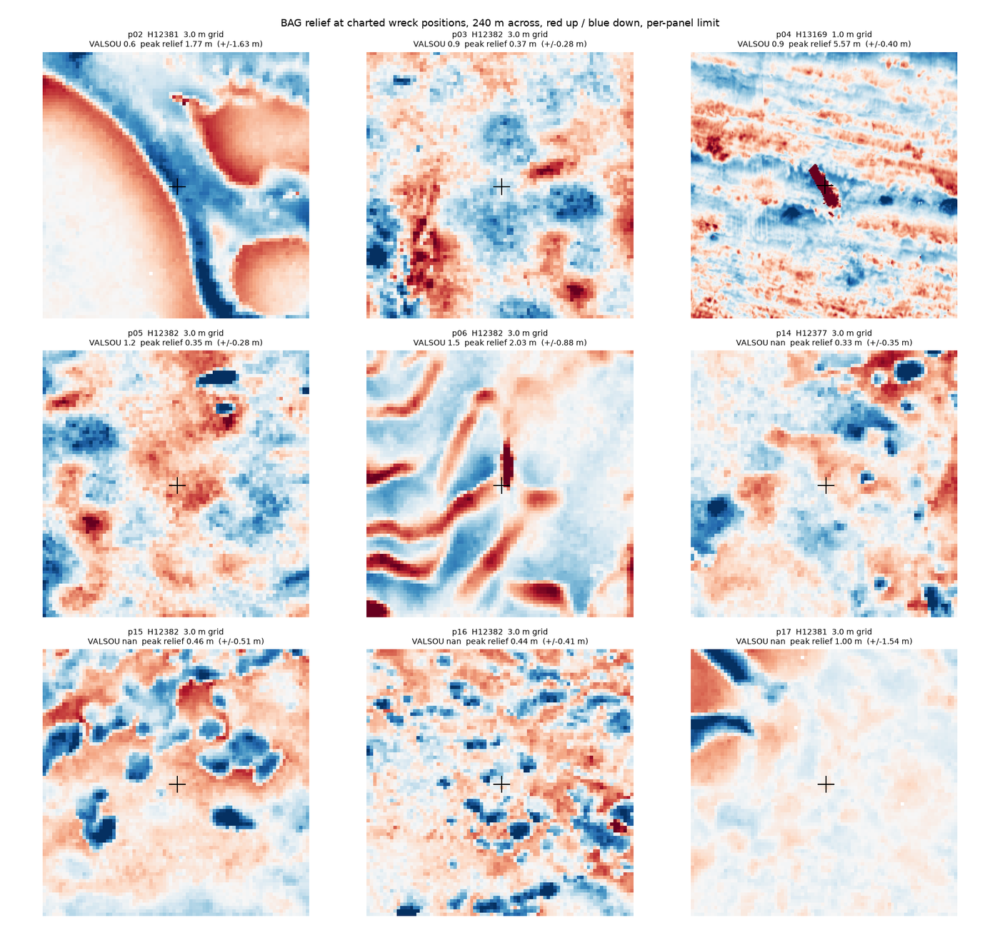
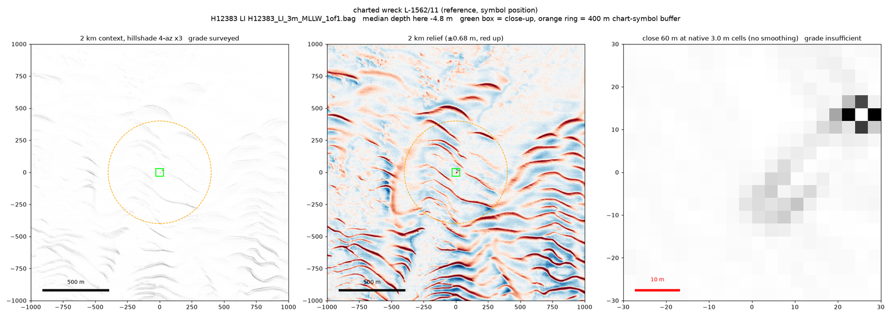
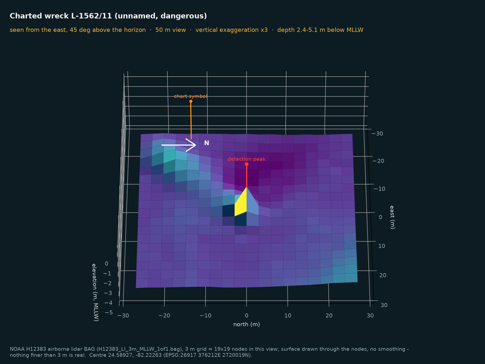
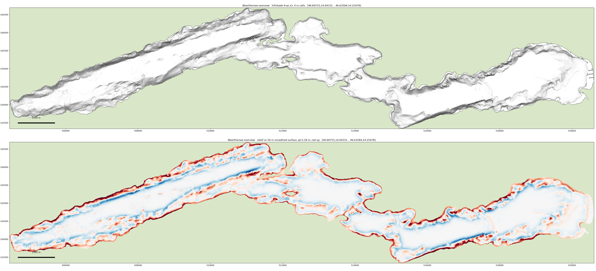

The idea sounds simple: seafloor surveys are public, wrecks are shapes on the seafloor, so a
program should be able to find them. Give it a box on the map, get back a ranked list of places
worth a diver's time.

It is not simple, and most of what I learned is about **why a pipeline like this lies to you**
and how to make it stop. This page is the short version of a long lab notebook, which is in
the repository.

> **What it is:** a *narrowing* tool, not a discovery tool. It takes thousands of square
> kilometres and hands an expert a few candidates, with measured error rates attached, so
> nobody has to guess how much to trust it.

## The stack

- **Python** with GDAL/rasterio, geopandas, shapely, pyproj and scikit-image
- **NOAA BAG** survey grids: the hydrographic office's own multibeam sonar and airborne lidar
  surveys at 0.5 to 4 m, read remotely in windows over HTTP, so a 500 MB grid never needs a
  full download
- **NOAA ENC** nautical charts as ground truth (charted wrecks, obstructions, rocks)
- **NAIP** aerial imagery (30 to 60 cm) through a public STAC catalogue, and **Sentinel-2**
  for clarity and depth context
- **COPC lidar point clouds**, subset over HTTP range requests
- a **vision-language model** as a keep/discard gate on rendered panels
- **pytest** guards for every silent failure found along the way

## Lesson 1: free data can be beautifully empty

The first data source looked perfect: a keyless national elevation mosaic that crosses the
waterline, clean 3 m grids over every known wreck, 100 % valid pixels.

Its pixel-scale roughness across 23 known wreck sites was **2 millimetres**. That is not a
seabed; it's a spline. The product is interpolated from sparse soundings, and the wrecks are
not faint in it. They are simply absent.

Worse, the interpolation leaves artefacts (fans around isolated soundings, facets, striping)
that are compact, elongated and locally anomalous. That is exactly what a wreck detector looks
for. Run on this data, it produces a confident, beautiful, entirely fictional candidate list.

**Fix:** switch to real survey grids, and put a **signal gate** in front of everything. Every
patch is graded for whether it holds real measurements before any detection runs. No model
quality fixes an input that never resolved anything.

## Lesson 2: recall means nothing without chance

The first scored run looked great: recall climbed to **100 %** at a 500 m match radius. It
also meant nothing. With 36 candidates per km², a random scatter of points hits a 100 m circle
68 % of the time, and the detector scored *below* that.

Every recall figure now ships with its **chance level and lift** (how much better than random
it is), and anything at or below chance prints `NO DEMONSTRATED SKILL`. On a busy harbour
survey, the honest baseline is about **2.3× better than chance at 50 m**. Modest, and real.

The same run showed what actually separates a wreck from harbour clutter: **height**. Length
and elongation were statistically identical between charted wrecks and riprap. Ranking by
relief doubled the hit rate of the top 50.

## Lesson 3: a chart symbol is not an object

Nautical charts mark wrecks with symbols, placed for navigation, not archaeology. Checked
against the survey data at nine charted positions in the Florida Keys:

**Two of nine** are really there. One is a textbook hull at 29 m depth, which is why aerial
imagery had shown nothing: far too deep to see. The other seven are mispositioned, broken up,
buried, or were never more than an old report. Chart points are fine for matching within a few
hundred metres; they are useless as pixel-level truth.

## Lesson 4: the model is a gate, not a ranker

A vision-language model looks at rendered panels (hillshade and relief, with the measured facts
stated) and answers: keep or discard. Measured on verified hull images from a known ship
graveyard plus clear-water negatives, the stronger model flagged **8 of 8 hulls and 0 of 40
negatives**, including two moving boats with wakes, the classic false positive.

What that took, and what it doesn't mean:

- **The prompt sets the operating point, not the model.** One wording change moved the small
  model from 1/6 hits to 4/6, and from zero false positives to nine.
- **Priors leak in.** The model reasoned that "wrecks are isolated", so a frame with a dozen
  hulls side by side looked like aquaculture to it. Graveyards are exactly where shallow wrecks
  cluster.
- **Its confidence is useless for ranking.** Scores come in four quantised values and correlate
  weakly with anything physical. Keep/discard from the model; ranking from the physics.

On the first real sweep (two surveys, 182 km², **6,531** detections), the model adjudicated the
top 777 for **$4.40**. 721 were rejected with sensible labels (422 sand waves, 87 channel
banks, 77 coral heads) and the combined rule left **6** for expert review.

## Lesson 5: what you see depends on the zoom window

This was the humbling part. On a second sweep over reef ground, the model flagged 26 % of
panels. When I reviewed the candidates by hand on a map, **14 of 14 were natural**: rock, coral
heads, patch reefs. The panels had been wrong in two ways at once:

- **Too far out** to see edges: at 10 to 50 m, "hull-like outlines" turn out to be rough and
  broken, like rock.
- **Too narrow** to see context: widen the window to a few hundred metres and the same form
  repeats ten times. A wreck is the odd one out; a reef is a pattern.

A charted reference wreck shows what the right view looks like:

Two more traps live in the rendering itself:

- **Autoscaled colour lies.** If each panel stretches its colour to its own range, "very red"
  means "top 2 % of this crop", not "tall". The quietest patch looks the most alarming.
- **Straight edges on a coarse grid prove nothing.** An object two to four cells wide renders
  with straight edges whatever it is. Edges can only be judged where at least ~10 cells cross
  the object.

So every candidate now gets **two views from the same grid**: a close-up at native resolution
with the cell size printed, for edges, and a 2 km context with multi-direction hillshade, for
uniqueness. The model and the human judge each question on the scale that can answer it.

## Lesson 6: know your instrument

Half of the "sonar" surveys turned out to be **airborne lidar**. The file names said so; I had
not read them. It matters: a dark or hard object can absorb the laser and return *nothing*, and
the gridding software may then fill the hole with a mound that was never measured. One
promising candidate had exactly that: a clear mound in the 2011 grid, and in the 2019 point
cloud a cluster of cells with no bottom return at all.

## Close to home: Austrian lakes

The latest step moved to Austria. Wörthersee has an open 1 m depth model from a 2017 multibeam
survey. The lake floor is quiet, which makes objects easier to separate. But the product is
smoothed, and most of the long straight lines are most likely the pipes and cables that run
along the bottom.

## Ethics

Publishing coordinates of unrecorded wrecks is how they get looted. The code, the method and
everything derived from already-public charts are open. Positions of unverified candidates stay
out of the repository; anything found goes to the heritage authority, not onto a map.

## What I would tell anyone building this

1. **Grade the input before you trust the output.** A clean grid can contain nothing.
2. **Report skill against chance**, never raw recall.
3. **Let the model gate, let physics rank.**
4. **Show every candidate at two scales**: the close-up for edges, the context for uniqueness.
5. **Look at the output yourself.** Every real error in this project was found by a person
   looking at pictures, not by a metric.
